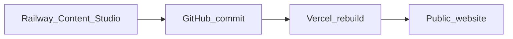

# Nam Viet Group — Corporate Website

Chapter-storytelling home page plus multi-page corporate site. Built with **Eleventy**, HTML/CSS/JS, trilingual **EN / VI / 中文**.

## Develop

```bash
npm install
npm run dev:cms
# Site  http://localhost:8125/
# CMS   http://localhost:8125/admin/  (API on :8081)
```

Or site only: `npm run dev`

## Build

```bash
npm run build
# Output: _site/
```

## Deploy (client handoff)



| Layer | Platform | URL |
|-------|----------|-----|
| Public website | **Vercel** | your domain / `*.vercel.app` |
| Content Studio | **Railway** | `https://…railway.app/admin/` |
| Content source | **GitHub** | markdown in this repo |

### 1) Vercel — website

1. Import repo → Framework **Other**
2. Build Command: `npm run build`
3. Output Directory: `_site`
4. Deploy → set custom domain
5. Update [`src/_data/site.json`](src/_data/site.json) `url` to the production domain and push

Config file: [`vercel.json`](vercel.json)

### 2) Railway — Content Studio

1. New service from the same GitHub repo  
2. Start command: `node scripts/admin-api.js` (see [`railway.json`](railway.json))  
3. Variables (see [`.env.example`](.env.example)):

| Variable | Purpose |
|----------|---------|
| `GITHUB_TOKEN` | Fine-grained PAT, Contents read/write |
| `GITHUB_REPO` | `owner/repo` |
| `GITHUB_BRANCH` | `main` |
| `ADMIN_USER` / `ADMIN_PASS` | Editor login |
| `CORS_ORIGIN` | Optional; default `*` |

4. Give the client: Railway `/admin/` URL + username/password  
5. Publishing commits to GitHub → Vercel rebuilds in ~1–2 minutes  

Details: [`src/admin/README.md`](src/admin/README.md)

### GitHub Pages (optional / legacy)

Workflow `.github/workflows/deploy.yml` still publishes to  
`https://picapika22.github.io/nam-viet-group-web/` with `PATH_PREFIX`. Prefer Vercel for the client domain.

## Configure

Edit [`src/_data/site.json`](src/_data/site.json):

- `url` — production canonical URL (Vercel / custom domain)
- `emailPartner` / `emailContact` / `phone` / `address`
- `formEndpoint` — Formspree form URL
- `whatsapp` / `zalo` — floating chat numbers

## Content

| Content | Path |
|---------|------|
| News | `src/news/posts/*.md` |
| Careers | `src/careers/jobs/*.md` |
| Products | `src/products/items/*.md` |

Editors use Content Studio (local or Railway). Developers can also edit markdown directly and push.
